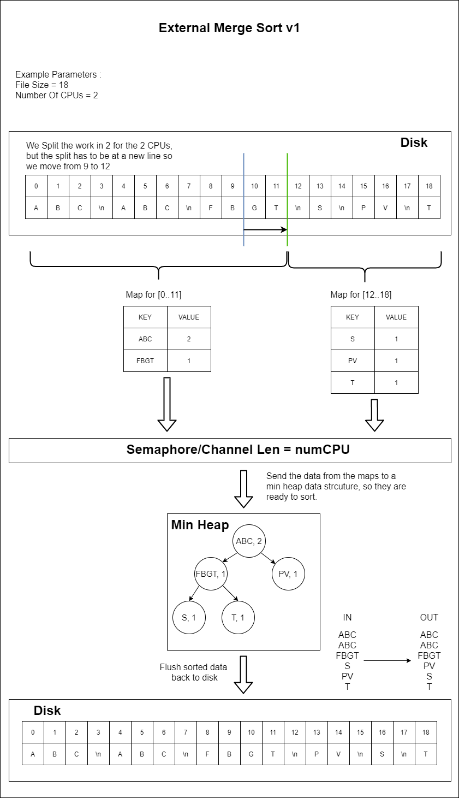

# Sort Large Files CMD Utilility

## Task Description

[TaskDescription PDF](./docs/TaskDescription.pdf)

## Documentation

Visually :



## Optional Dependencies for building

install https://github.com/go-task/task

**This tool is not needed for the program to work, but it makes for less typing.**

## Usage

After installing the task build tool you can run this in the root of the project :
```bash
task run
```

You can verify the output with :
```bash
task verify
```

And you can generate file with random strings :
```bash
task generate
```

The `Taskfile.yml` can be used to specify which file to sort and where to write the result, as well as some other options:
```yml
version: '2'

tasks:
  run:
    cmds:
      - go run main.go
    env:
      IN_FILE: ./data/dataset-1MB
      OUT_DIR: ./out
      TRACE: true
  verify:
    cmds:
      - go run ./tools/verify/verify.go
    env:
      SORTED_FILE_PATH: ./out/sorted # Where is the file to check
  generate:
    cmds:
      - go run ./tools/generate/generate.go
    env:
      GEN_COUNT_MB: 100 # Size of the generated output
      OUT_DIR: "./data"
      FILE_NAME: "tmp" # What name should the file have
```
